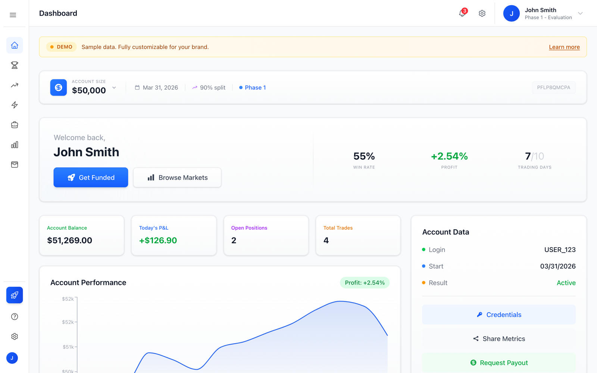
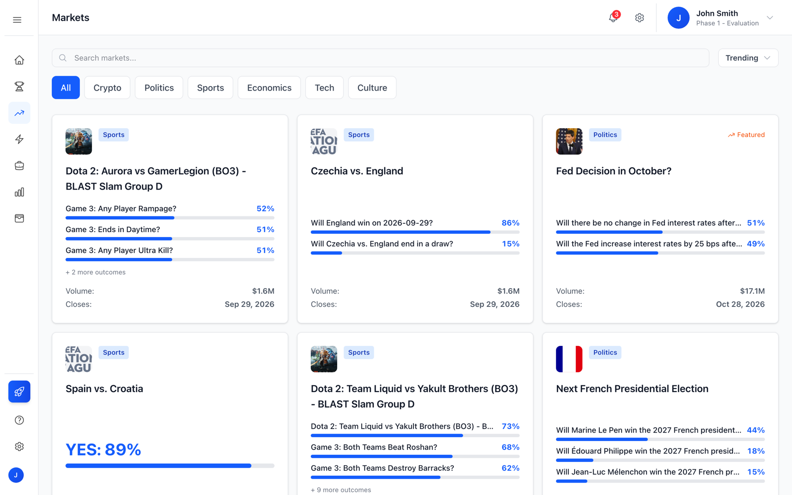
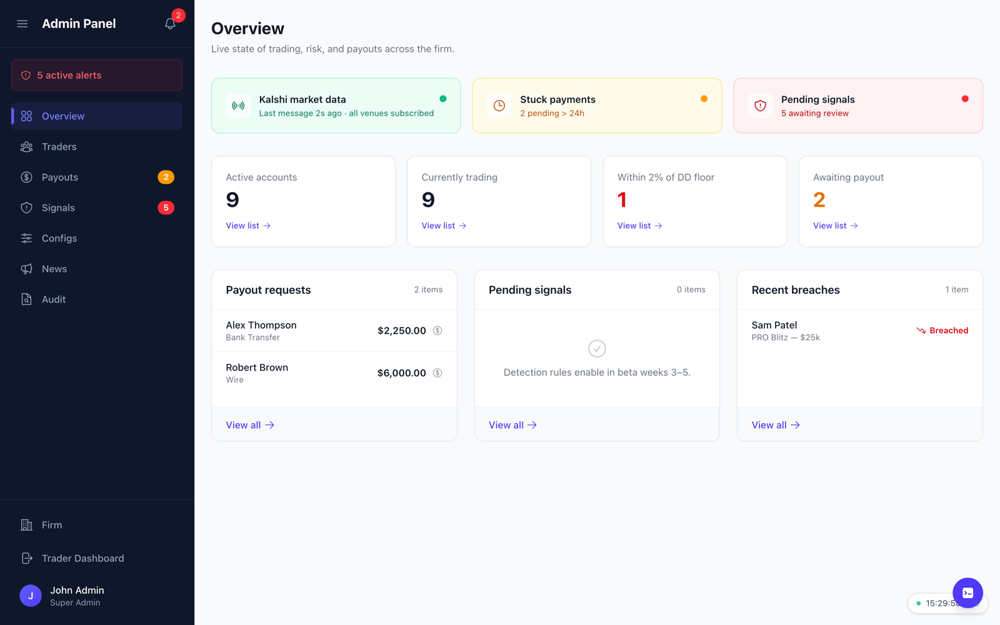
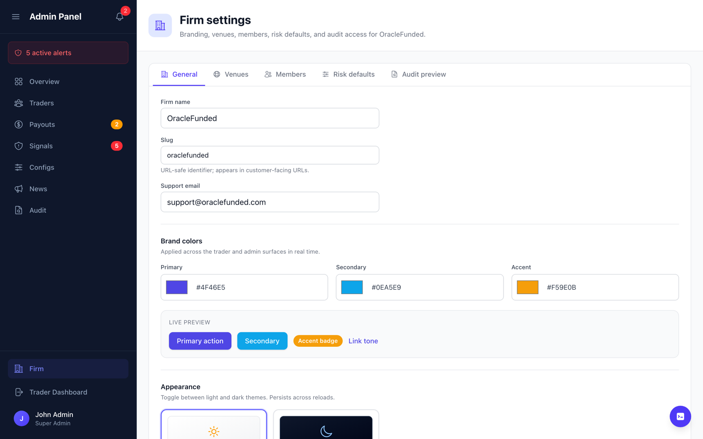

# Prediction Markets Prop Firm

A white-label platform for prop firms that fund traders on prediction markets: a trader dashboard, an evaluation challenge, and the admin console a firm uses to run it.

The trader pays a fee, trades a simulated account against real market prices, and gets funded if they hit a profit target without breaching a drawdown limit.
The same model the forex and futures prop firms run, pointed at Polymarket and Kalshi.
This repo is the front end of that product, built to put in front of prop firms and validate the idea before the backend exists.

- **Live demo:** https://prediction-markets-prop-firm.vercel.app (sign up required)
- **App code:** [`oracle-funded/`](./oracle-funded), branded as a sample firm called OracleFunded

---

## What is real and what is not

This is a prototype, and the line is worth drawing precisely.

**Real:**

- **Market data.** `/api/markets` pulls live events from Polymarket's Gamma API, groups multi-outcome events, maps tags into categories, and converts prices, bids and asks to cents.
  If the API is unreachable the app falls back to mock markets rather than rendering an empty page.
- **The trader and admin interfaces**, end to end, with every page wired and navigable.
- **Authentication** through Clerk.
- **White-labelling.** A firm's name, colours and theme are applied at runtime through CSS variables, with a live preview in the admin settings.
- **The data model.** A 17-table Supabase schema covering firms, challenge configs and phases, accounts, orders, trades, positions, drawdown snapshots, breach events, payments, payouts, cheat signals and an audit log.

**Not yet real:**

- Trades execute against client-side state, not an order engine.
- Accounts, positions, traders, payouts and alerts are mock data.
- Prices between fetches move on a seeded random walk (`lib/priceWalk.ts`) so the UI feels live.
- The schema is written but not connected, and has no row-level security policies yet.
- There is no Kalshi integration and no payment flow.

The build plan for the backend is in [`WebFlux_MVP_Plan.md`](./WebFlux_MVP_Plan.md): a worker holding the Kalshi WebSocket, an evaluation tick loop for static and trailing drawdown, Stripe Checkout with webhook idempotency, and multi-tenancy through Supabase RLS.

---

## Screenshots

| | |
|---|---|
|  |  |
| **Trader dashboard.** Account, challenge phase, equity curve and the actions a funded trader needs. | **Markets.** Live Polymarket events, filtered by category and sorted by trend. |
|  |  |
| **Admin overview.** What a firm operator watches: accounts near their drawdown floor, payouts waiting, recent breaches. | **Firm settings.** Brand colours and theme, applied across both surfaces as they change. |

---

## What the trader gets

- A dashboard with account size, profit split, challenge phase, balance, daily P&L and an equity curve.
- Market browsing with search, category filters and sorting, and a trade ticket for YES and NO positions.
- Challenge progress against the profit target, minimum trading days and drawdown limits.
- Portfolio, trade history and analytics.
- A rules page walking through the evaluation phases, and a payouts page.
- Several accounts at once, with a switcher that remembers the last one used.

## What the firm gets

- An overview of live state: active accounts, accounts within 2% of their drawdown floor, pending payouts, recent breaches.
- Trader management with filters, batch actions, CSV export and a per-trader detail view.
- A payout queue, a signals queue for suspected cheating, and an audit log.
- Challenge configuration: account sizes, targets, drawdown rules and pricing.
- Firm settings: branding, venues, members and risk defaults.

---

## Stack

Next.js 16 App Router, React 19, TypeScript, Tailwind CSS v4, Clerk, Recharts and Framer Motion, with Radix primitives underneath the interactive components.
Deployed on Vercel.

## Running it

```bash
cd oracle-funded
pnpm install
pnpm dev
```

Clerk needs `NEXT_PUBLIC_CLERK_PUBLISHABLE_KEY` and `CLERK_SECRET_KEY` in `oracle-funded/.env.local`.
A development instance from the Clerk dashboard is enough.

## Layout

```
oracle-funded/
  src/app/
    api/markets/        Polymarket fetch and normalisation
    dashboard/          Trader surface: markets, challenge, portfolio, history, analytics, payouts
    admin/              Firm surface: traders, payouts, signals, configs, news, audit, firm settings
  src/context/          App state, admin state, firm branding, notifications
  src/lib/              P&L and drawdown calculations, analytics, CSV export, price walk
  src/data/             Mock accounts, traders, positions, payouts and alerts
  supabase/migrations/  The schema the backend will run on
WebFlux_MVP_Plan.md     Backend build plan
```
